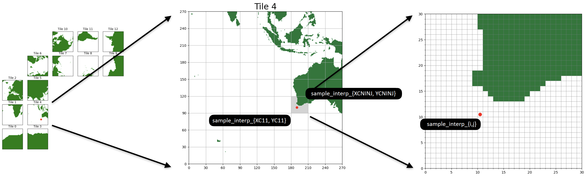

# Preprocessing for `pkg/profiles` and `pkg/obsfit`
### Authors
Goldberg, M., Griffin, C., & Reich, S., Processors, LLC.

### Background
MITgcm allows users to compare data with model equivalent information, often for the purpose of optimization of a misfit. There are three primary packages used to accomplish this task:
1. `pkg/ecco`: Used for gridded data, i.e. datasets that have been mapped to a MITgcm model grid
2. `pkg/profiles`: Used for ungridded profile data. When dealing with sparse ctd data, embedding profiles into gridded fields a la `pkg.ecco` results in needlessly sparse fields. To lessen the memory burden, `pkg/profiles` was developed to interpolate profiles or vertical columns of data into the model grid for model-data comparison
3. `pkg/obsfit`: In the case in which the user wants to compare pointwise ungridded observational data defined by their latitude, longitude, and depth, it may be wasteful to use profiles. `pkg/obsfit` was created for these cases.

## Files and folders in your project repository

### Collaborators

| Name | Personal goals | Can help with | Role |
| ------------- | ------------- | ------------- | ------------- |
| Caeli G. | | | Project Lead |
| Matthew G. | Write modular open source code | Providing template routines to build off of | Project Lead |
| Shoshi R. | | | Project Lead |

### The problem

Presently, there are no known (to the authors) publicly available preprocessing routines for `pkg/profiles` and `pkg/obsfit` written in python. Gael F. has a [public set of routines in MATLAB](https://github.com/MITgcm/MITprof), which serve as inspiration for this project. Given that the ECCO community has embraced python in recent years, in particular harnassing `xarray`, we see the addition of a python data preprocessing module to be an attractive contribution to the community.

## Project goals and tasks

### Project goals

* Produce a new python package to preprocess profiles and obsfit data
* Create jupyter notebooks demonstrating different uses of the package, examining different routines within the package

### Tasks

* Preprocessing routines specific to `obsfit`
  * Distinction between sample and obsfit
* Preprocessing routines specific to `profiles`
  * Aggregate profiles from multiple tiles [see Ariane's pull request](https://github.com/MITgcm/MITgcm/pull/836)
* Preprocessing routines shared by `obsfit` and `profiles`:
  * from _ungridded_ lat/lon, use `pyresample` to compute nearest _gridded_ lat/lon (careful at the poles!) 
  * assign_sample_interp: given gridded `point`s, assign LLC interp fields
* Write tests, documentation, continuous integration?

## Future additions
- Put nearest neighbors search mapping ungridded -> gridded inside MITgcm
- Examine treacherous interpolation at the poles

## Project Results